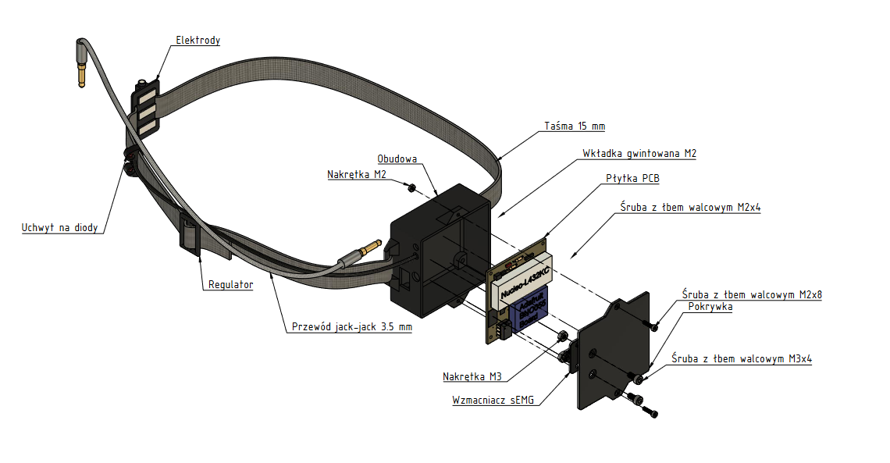

# Hands-free computer pointing device
## Engineer's Thesis

Main goal was to design a pointing device for people with motor disabilities of the upper limbs, dedicated to be used with personal computers and construction of a functional prototype. Device uses head movement tracking and reads electromyographic voltage from user’s forehead. It is a substitute of generic computer mouse – it has the ability to move cursor, simulate left and right mouse buttons and scroll through pages. With this device, it is possible to handle basic tasks, such as typing address and visiting websites, writing short messages using communicator.

## Features
- Head rotation is transformed into cursor movement
- Left mouse button click is triggered by muscle contraction, readen by EMG sensor
- Head gestures allow to use right mouse button and scroll

## Hardware
- Works under control of STM32 microcontroller
- Acts as a HID device after plugging into USB port
- BNO055 IMU sensor for measuring head rotations
- EMG electrodes placed on forehead, connected to a differential amplifier

## Software
- I2C bus used to communicate between IMU and MCU
- Timers utilized for program flow control (no delays)
- DMA feature used for efficient ADC conversion
- Raw EMG signal processed using Root Mean Square method
- FPU coprocessor improves floating point calculations

(uwaga zmyłka) w nazwie projektu jest człon 'test', ale jest to ostateczna wersja
