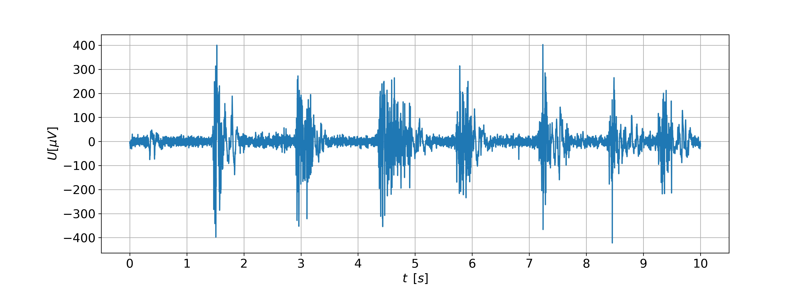
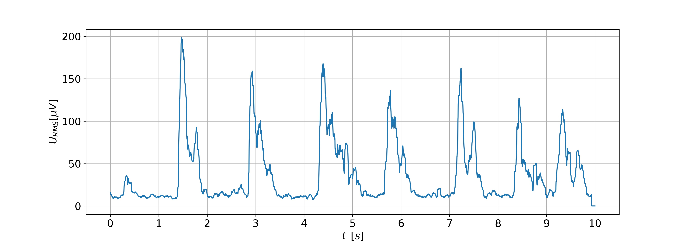
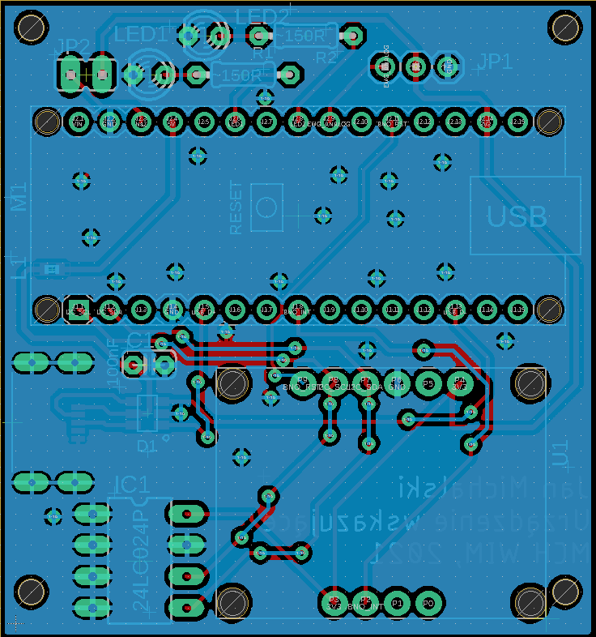
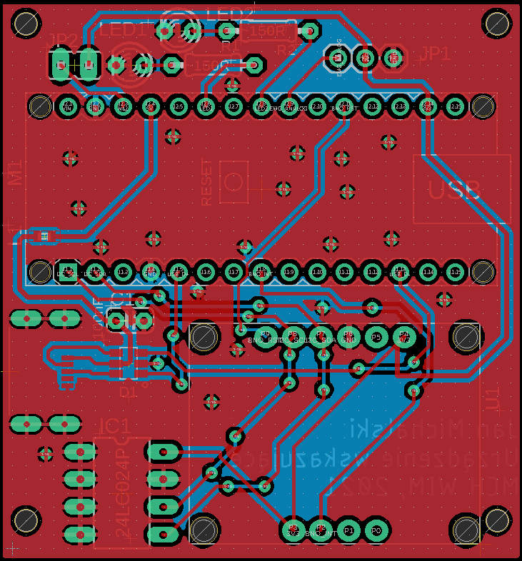

# Hands-free computer pointing device
Pointing device for people with mobility disabilities of the upper limbs     
## Engineer's Thesis

Main goal was to design a pointing device for people with motor disabilities of the upper limbs, dedicated to be used with personal computers and construction of a functional prototype. Device uses head movement tracking and reads electromyographic voltage from user’s forehead. It is a substitute of generic computer mouse – it has the ability to move cursor, simulate left and right mouse buttons and scroll through pages. With this device, it is possible to handle basic tasks, such as typing address and visiting websites, writing short messages using communicator.

## Features
- Head rotation is transformed into cursor movement
- Left mouse button click is triggered by muscle contraction, readen by EMG sensor
- Head gestures allow to use right mouse button and scroll

1-minute demonstration
https://www.youtube.com/watch?v=y53N9A561EY

## Model

## Hardware
- Works under control of STM32 microcontroller
- Acts as a HID device after plugging into USB port - classic PC mouse emulation
- BNO055 IMU sensor for measuring head rotations
- Surface EMG electrodes placed on forehead, connected to a differential amplifier

## Software
- I2C bus used to communicate between IMU and MCU
- Timers utilized for program flow control (no delays)
- DMA feature used for efficient ADC conversion
- Raw EMG signal processed using Root Mean Square method
- FPU coprocessor improves floating point calculations

## EMG signal processing
- Root Mean Square was used to smoothen data
- Muscle contraction was successfully recognized, although system was very sensitive to disruptions

_EMG signal before processing_

_EMG signal after processing_

## PCB Design

_PCB Bottom layer_

_PCB Top layer_

## What should be improved
- 'Dry' electrodes tended to move during muscle contraction, which caused high (although easy to detect) EMG signal peaks
- Electrodes should be pressed pretty firmly to user's forehead, which could be uncomfortable during long periods of device usage
- There was a constant threshold EMG value defined in program, which was used to determine muscle contraction. Because of this, device had to be often recalibrated. 

